# Shoe and Shirt Shop

## Overview

This is a Full Stack web application built using the Django framework. It allows users to browse and purchase shoes and shirts, create and manage their accounts, add items to their basket, and check out securely.

## Features

- **Full Stack Web Application**: Built using Django, incorporating a relational database and multiple apps.
- **Front-End Design**: Meets accessibility guidelines, follows UX design principles, and provides a set of user interactions.
- **Interactive Front-End**: Includes forms with validation for creating and editing models.
- **Consistent Django File Structure**: Follows Django conventions.
- **Clean Code**: Demonstrates characteristics of clean code.
- **Defined URLs**: Application URLs are defined in a consistent manner.
- **Navigation and Layout**: Includes a main navigation menu and structured layout.
- **Custom Logic**: Shows proficiency in Python with functions including compound statements.
- **Testing Procedures**: Manual or automated tests assess functionality, usability, responsiveness, and data management.

## Dependencies

- **Django**: Web framework for building the application.
- **djangorestframework**: For building REST APIs.
- **Stripe**: For payment processing.
- **HTML/CSS/JavaScript**: For front-end development.
- **Bootstrap**: For responsive design.
- **jQuery**: For enhanced interactivity.
- **PostgreSQL**: Relational database management system.
- **Gunicorn**: WSGI HTTP server for deploying the application.
- **Whitenoise**: For serving static files in production.
- **Bootstrap**: For styling

## Database Design

- **Relational Database Schema**: 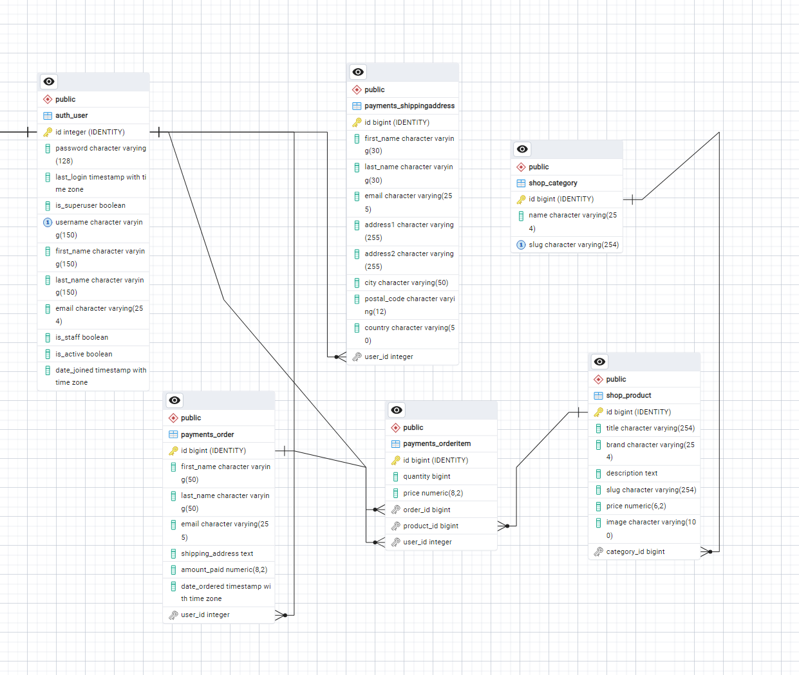
- **Custom Django Models**: 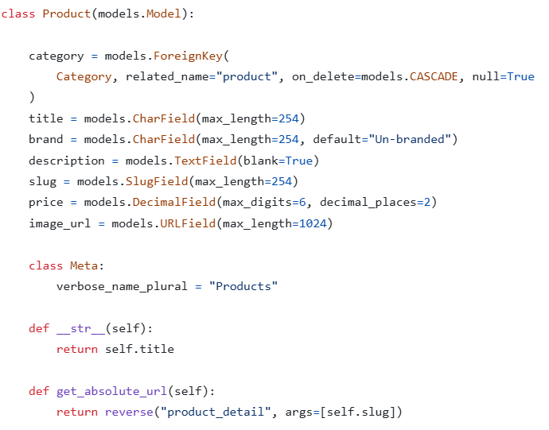
- 
- 
- **Form Validation**: 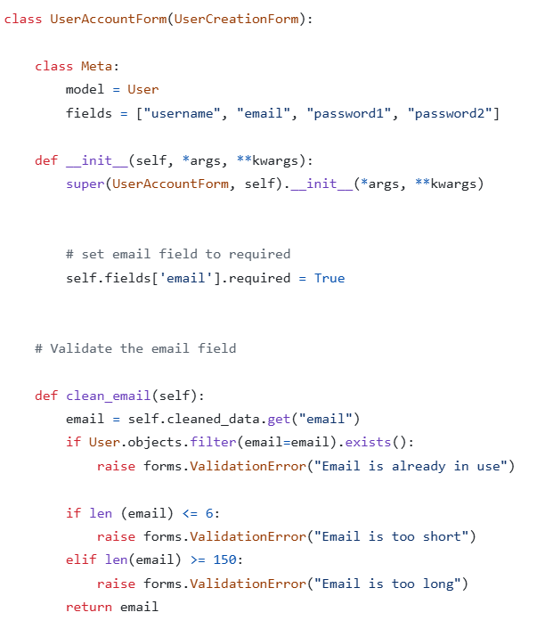
- **CRUD Functionality**: 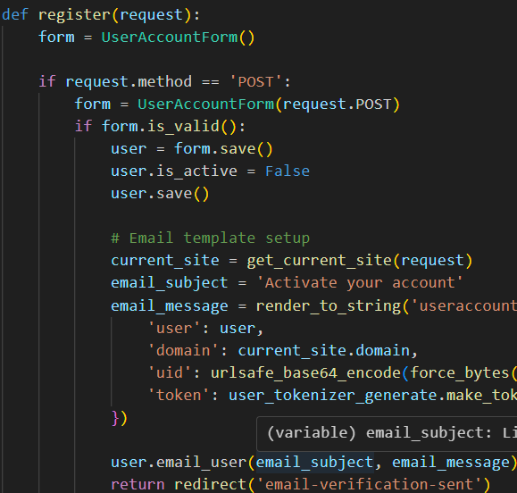
- 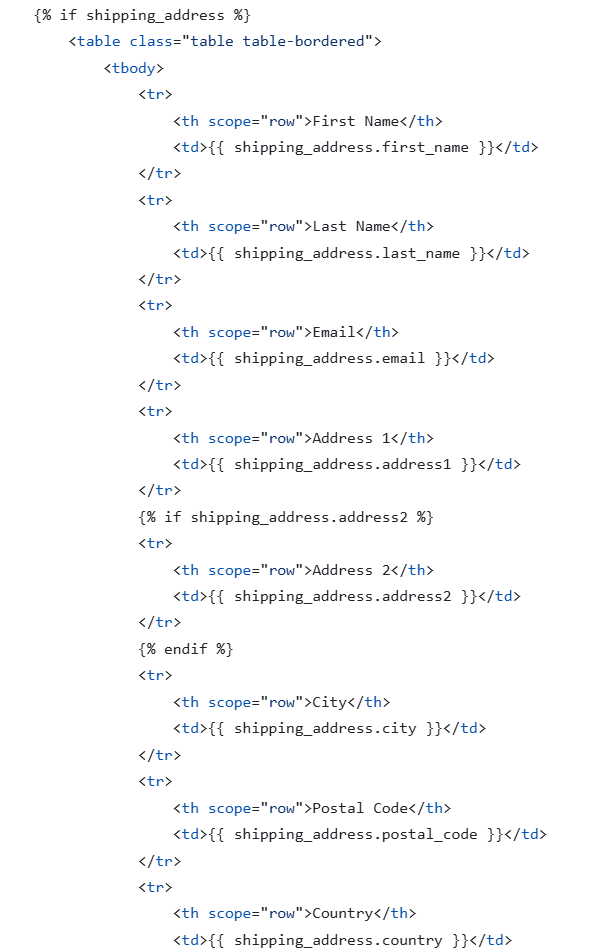
- 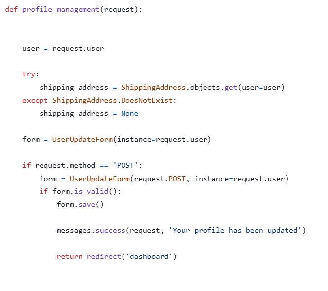
- 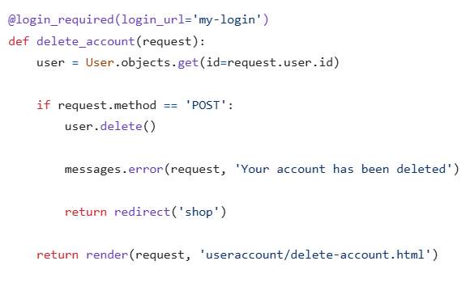

## Authentication

- **User Authentication**: 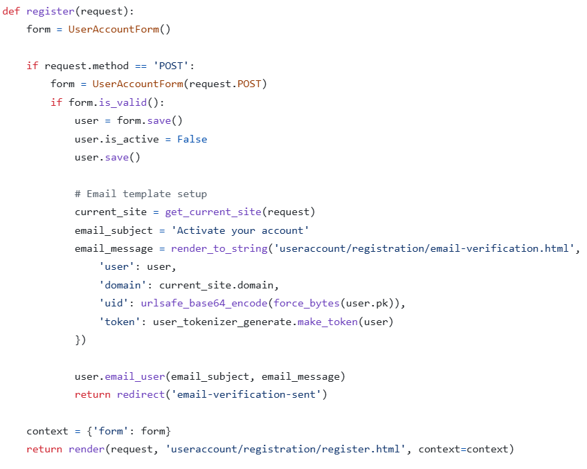
- 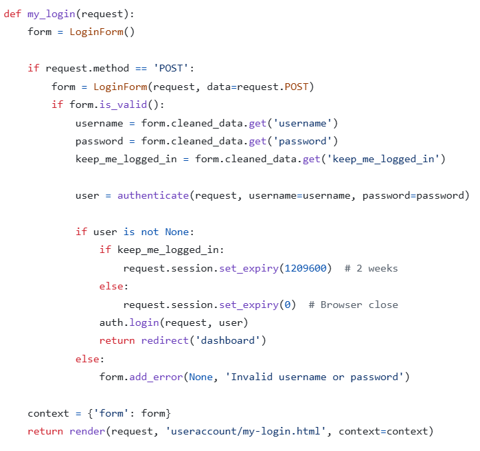
- 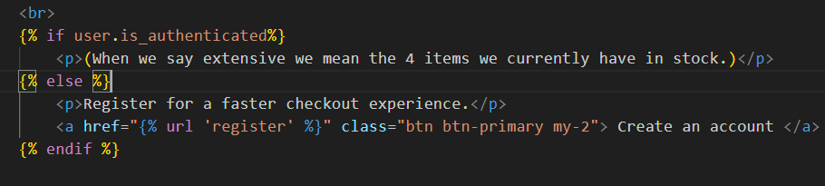
- **Access Control**: Log-in and registration pages are only available to anonymous users.
- 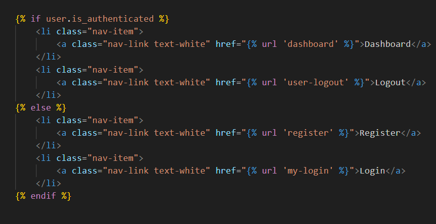
- **Data Store Security**: 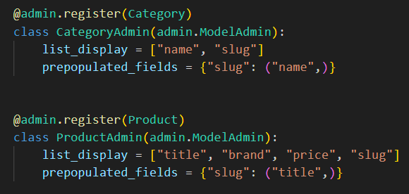
-

## E-Commerce Functionality

- **Shopping Cart**: 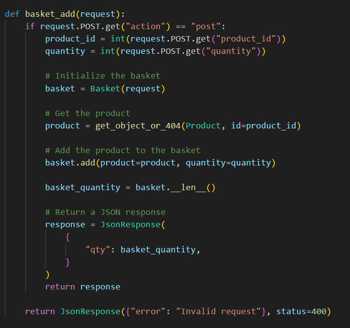
- **Payment Processing**: 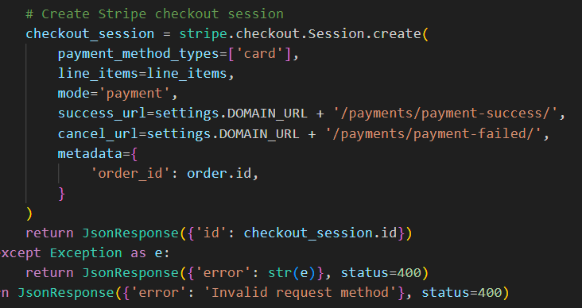
- **Feedback System**: 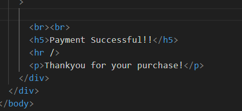
- 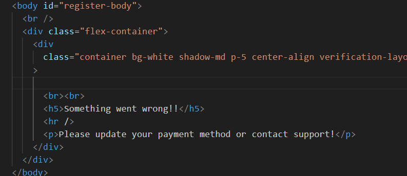

## Deployment

- **Hosting**: Final version is deployed to heroku <https://easystreet-fcfbb4b54019.herokuapp.com/>
- **Code Cleanliness**: No commented-out code or broken internal links in the final deployed code.
- **Security**: No passwords are stored in the git repository, secret are keys hidden in herokus config vars , and DEBUG mode is turned off.
- **Version Control**: [Used a git-based version control system, with regular commits.](https://github.com/AlexanderMarriott/milestone4/commits/master/)
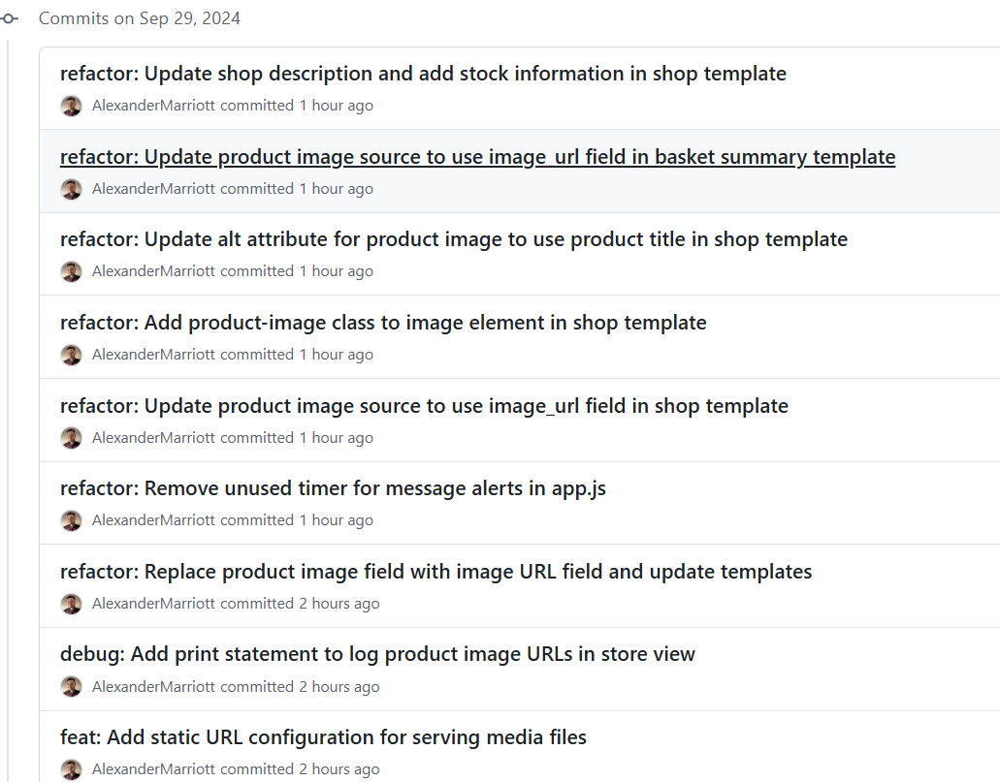

## Installation

1. Clone the repository:

    ```bash
    git clone https://github.com/AlexanderMarriott/milestone4/tree/master
    ```

2. Navigate to the project directory:

    ```bash
    cd milestone4
    ```

3. Create a virtual environment:

    ```bash
    python3 -m venv env
    source env/bin/activate  # On Windows use `env\Scripts\activate`
    ```

4. Install dependencies:

    ```bash
    pip install -r requirements.txt
    ```

5. Set up the database:

    ```bash
    python manage.py migrate
    ```

6. Create a superuser:

    ```bash
    python manage.py createsuperuser
    ```

7. Run the development server:

    ```bash
    python manage.py runserver
    ```

Note: you will need to obtain your own api keys for stripe/postgresql database and google mail in order for this site to function correctly.

## Usage

1. Register a new user or log in with an existing account.
2. Browse the inventory of shoes and shirts.
3. Add items to the basket and proceed to checkout.
4. Complete the purchase using the integrated payment system.
5. Receive feedback on the purchase status.

## Testing

- **Functionality Tests**: Manually tested all aspects of the site and checked logs throughout to see any issues that may of popped up
- **Usability Tests**: I created the site to be intuative. One thing i noticed on testing is that the transition from one product to the next could be smoother, but it doesn't take away from the overall experience.
- **Responsiveness Tests**: The app functioned perfectly on all the devices i had to hand.
- **Data Management Tests**: I made use of the csfr tokens on all forms in order to maintain security and valid data.

## Purpose and Value

This application provides a convenient platform for users to purchase shoes and shirts online, with a seamless shopping experience from account creation to checkout.
